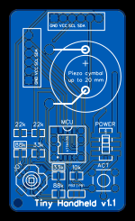
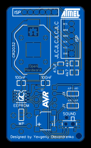
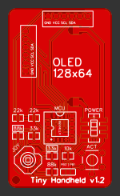
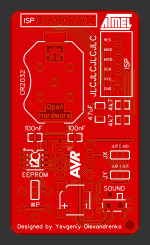

# Hardware instructions
**Do not try to use PCB v1.0! It has some mistakes and design flaws!**

The PCB v1.1 or PCB v1.2 is a good choice to build. Version 1.2 has some design improvements and no longer supports piezo cymbals. For more information about hardware please see **[the latest schematic](./v1.2/Schematic.pdf)**.

**EasyEDA** project **[HERE](https://easyeda.com/yevgeniy.olexandrenko/tiny-joypad-v2)**.

## PCB v1.1 ##

## PCB v1.2 ##

